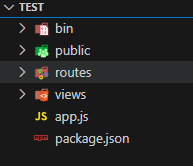

## 环境
+ `node v20.13.1`
+ `npm v10.5.2`
+ `express-generator v4.16.1`

:::::info[提示]
只是我个人的开发环境，不用一致
:::::

## 创建express项目
```cmd
# 全局安装express-generator
npm i express-generator -g

# 创建项目
express [SERVER_COPY]  // 【项目名称】
```
目录如下



项目终端运行
```cmd
npm install
```

## 新增目录
根目录新建文件夹
+ controller
+ middleware
+ service
+ swagger
+ utils

根目录新建文件
+ .env
+ .env.production
+ .gitignore


## 热启动
> 安装`nodemon`

```cmd
mpm i nodemon
```

更改`package.json`
```js title="package.json"
{
   ...
   "scripts": {
      // highlight-next-line
      "start": "dotenv -e .env nodemon ./bin/www"
   }
   ...
}
```
运行`npm run start`就可以热启动啦