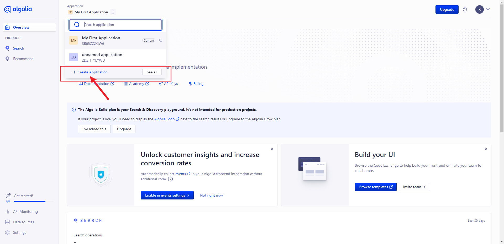
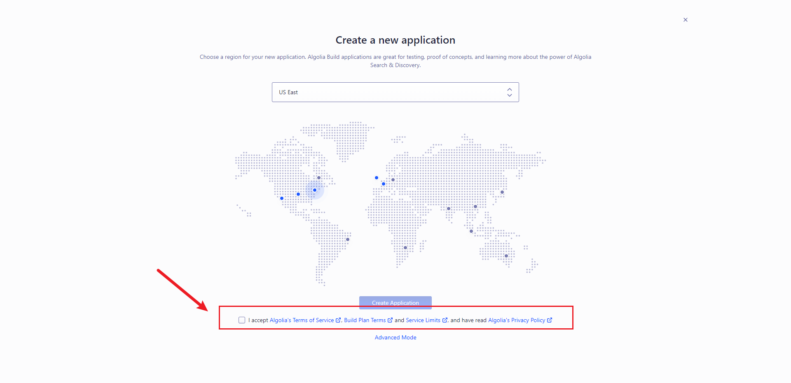
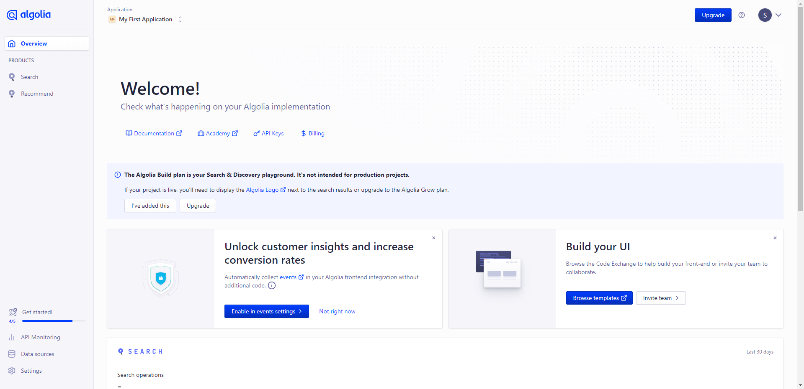
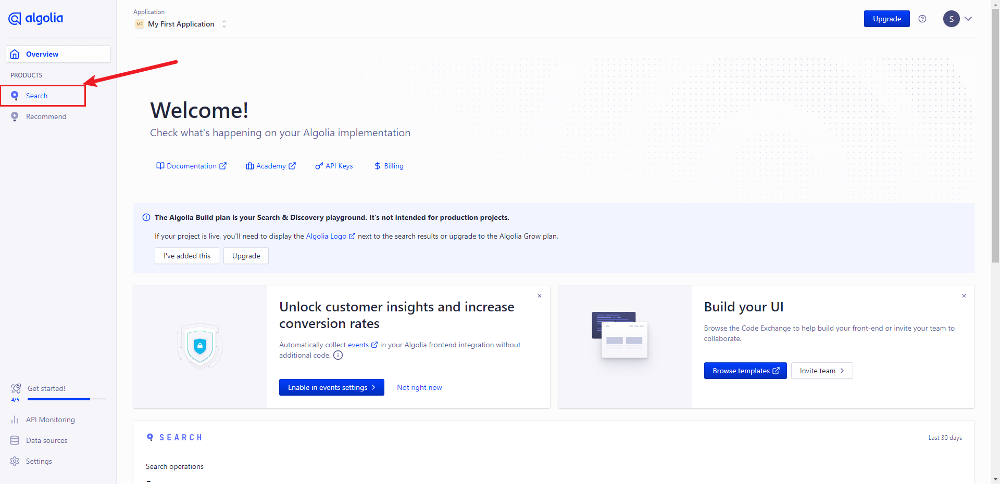
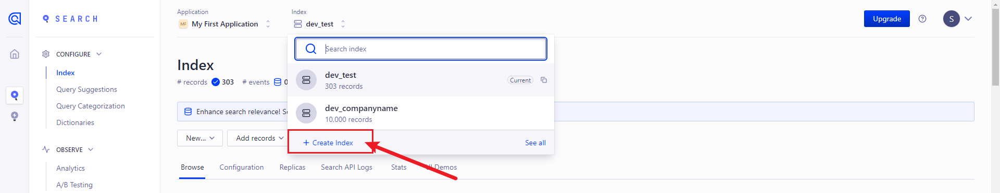
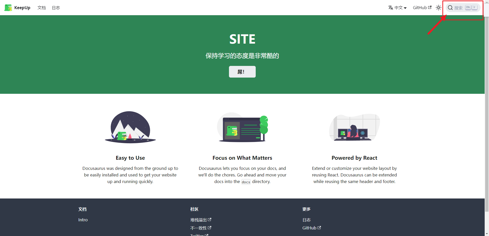
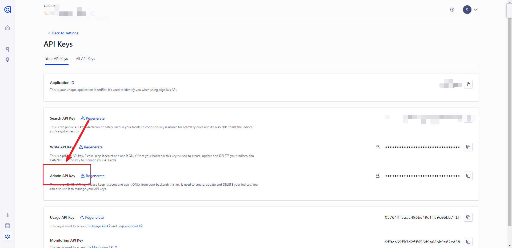
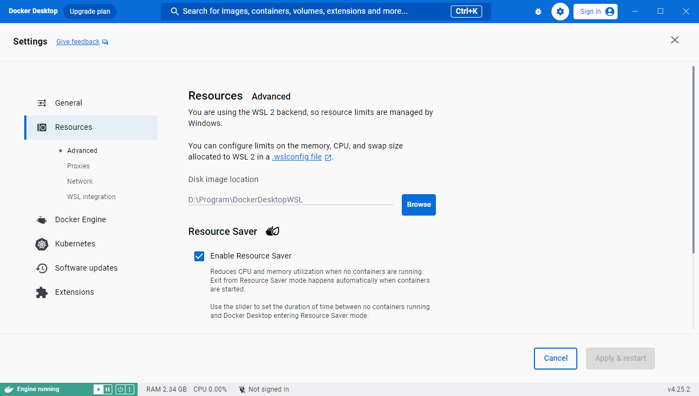
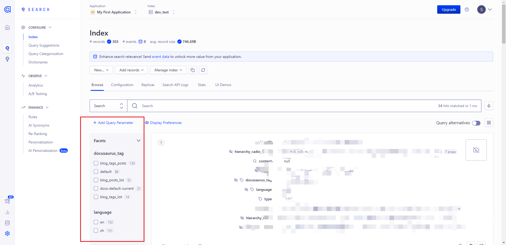
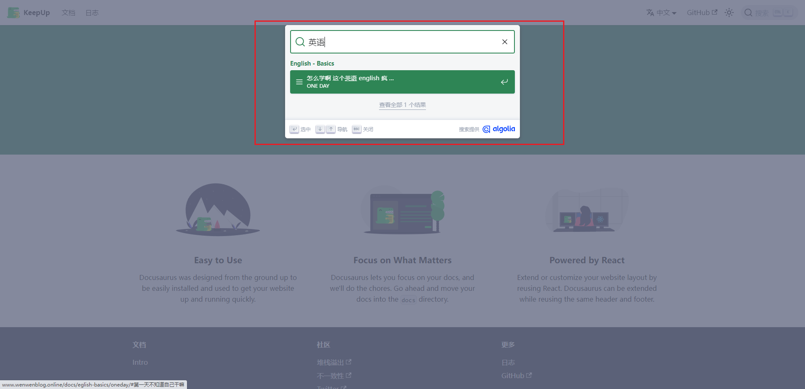

## 在 Docusaurus 中使用 Algolia 实现搜索功能

介绍如何在 Docusaurus 中去使用 Algolia 搜索我们的文章以及文章内的文字，让使用者能够在我们的 Docusaurus 博客文档中输入关键字找到自己想看到的文章。

文章要已经发布到线上也就是部署在了我们的服务器，GitHub或者是国内阿里云 腾讯云等都可以。
本章参考链接：

[**WeiYun0912**](https://weiyun0912.github.io/Wei-Docusaurus/docs/Docusaurus/Algolia/#%E7%88%AC%E5%8F%96%E8%B3%87%E6%96%99%E4%B8%A6%E6%96%B0%E5%A2%9E%E8%87%B3-algolia)


## 安装

现在的 Docusaurus 已经是V3版本，不需要我们手动安装插件 `@docsearch/react`，所以这一步我们直接跳过。

## 注册Algolia

[Algolia官网](https://dashboard.algolia.com/) 进行注册，直接使用GitHub账号就可以直接登录。

登录成功后进入控制台

点击`Create Application`创建应用。

当出现这个界面就说明已经创应用成功了。

创建成功后再建一个index。


之后就能看到正常的index所在的页面
>这个application就相当是于你的项目，在你的这个项目里面可以有很多个的子应用也就是你的index，可以更具体的定位。


## 接下来就是写我们的项目的配置文件了
在我们的`docusaurus.config.js`中的`themeConfig`这一条新增

+ apiKey : Algolia 的 API Key，记得是我们刚刚新增的那条 apiKey。
+ indexName : Algolia 的 index 名称(创建的时候自己取的)。
+ appId : Algolia 的 Application ID。

```javascript title="docusaurus.config.js" 
...
themeConfig: ({
  algolia: {
    apiKey: "b14c96609eebac13e6412d80802884bb",
    indexName: "docusaurus-demo-algolias",
    appId: "XWN4XQZ58C",
  },
  ...
});
```
配置后出现以下图片的搜索框就是成功了

这个搜索是不会有任何内容出现的，因为我们网站的内容并没有被algolia所爬取，所以接下来就是比较难的部分了。

## 配置环境变量以及创建config文件
我们需要安装algolia官网一样写一下相关的配置
1.首先在项目根目录创建`.env`文件
````javascript title=".env"
APPLICATION_ID=your_id
API_KEY=your_key
````
把这里的id和key换成你的`application`的`id`以及`your api keys`中的`admin api key`，注意一定要是`admin api key`不然权限不够，后续操作会出现不必要的问题。


之后再创建`config.json`
有三个地方需要改
+ index_name：你的 Algolia index 名称
+ start_urls：你的 Docusaurus 部署上线后的网站
+ sitemap_urls：你的 Docusaurus 網址的 sitemap
> `sitemap_urls`就是项目打包后直接通过域名或者是ip+端口地址 后面跟上`/sitemap.xml`

```javascript title="config.json"
{
  "index_name": "docusaurus-demo-algolias",
  "start_urls": ["https://weiyun0912.github.io/Docusaurus-Demo-Algolia/"],
  "sitemap_urls": [
    "https://weiyun0912.github.io/Docusaurus-Demo-Algolia/sitemap.xml"
  ],
  "sitemap_alternate_links": true,
  "stop_urls": ["/tests"],
  "selectors": {
    "lvl0": {
      "selector": "(//ul[contains(@class,'menu__list')]//a[contains(@class, 'menu__link menu__link--sublist menu__link--active')]/text() | //nav[contains(@class, 'navbar')]//a[contains(@class, 'navbar__link--active')]/text())[last()]",
      "type": "xpath",
      "global": true,
      "default_value": "Documentation"
    },
    "lvl1": "header h1",
    "lvl2": "article h2",
    "lvl3": "article h3",
    "lvl4": "article h4",
    "lvl5": "article h5, article td:first-child",
    "lvl6": "article h6",
    "text": "article p, article li, article td:last-child"
  },
  "strip_chars": " .,;:#",
  "custom_settings": {
    "separatorsToIndex": "_",
    "attributesForFaceting": ["language", "version", "type", "docusaurus_tag"],
    "attributesToRetrieve": [
      "hierarchy",
      "content",
      "anchor",
      "url",
      "url_without_anchor",
      "type"
    ]
  },
  "conversation_id": ["833762294"],
  "nb_hits": 46250
}
```
## 安装Docker
我跟我参考的那位博主一样是windows环境下作业所以一样需要先安装[docker desktop](https://docs.docker.com/desktop/install/windows-install/) 也就是docker桌面版
安装过程会出现一些问题如果没有就万事大吉，以下是我安装的时候遇到的问题。
### 盘符空间不够
`docker desktop`默认安装在C盘。我的C盘空间不足导致安装不了，所以这个时候需要去修改默认安装目录。
+ 提前在D盘新建Program\Docker，进入到你下载好`Docker Desktop Installer.exe`的目录打开cmd，使用这行代码安装最后显示Installation succeeded代表安装成功 ：
````javascript
"Docker Desktop Installer.exe" install --installation-dir="PATH"
````
> 将`PATH`替换成你要安装的指定目录

### 更改镜像默认保存路径
嫌麻烦 并且C盘足够大的同学这一步可以跳过了
+ 点击`Resources`更改`Advanced`的目录就可以了


## 使用Docker搭建环境爬取文档数据
如果你没有遇到以上安装障碍那么就可以直接进行到这一步了
### 安装`chocolatey` 以及 `jq`
使用 `chocolatey` 安裝 `jq`，先來安裝 `chocolatery`，將 `cmd` 用管理员身份运行，执行以下指令:
````javascript
@"%SystemRoot%\System32\WindowsPowerShell\v1.0\powershell.exe" -NoProfile -InputFormat None -ExecutionPolicy Bypass -Command "iex ((New-Object System.Net.WebClient).DownloadString('https://chocolatey.org/install.ps1'))" && SET "PATH=%PATH%;%ALLUSERSPROFILE%\chocolatey\bin"
````
我们的`chocolatey`就安装成功了

接下来安装`jq`
> 注意：最新版的`chocolatey`执行命令不是`chocolatey`而是`choco`，所以这里执行:
````javascript
choco install jq
````
### 爬取网站数据至 Algolia
看到这里 说明已经接近胜利的曙光了，再坚持一下就能完成我们今年的`KPI`，哦呸，是一个搜索功能
+ 我们使用`Git bash`打开我们的项目根目录运行一下命令
````javascript
docker run -it --env-file=.env -e "CONFIG=$(cat ./config.json | jq -r tostring)" algolia/docsearch-scraper
````
+ 如果出现winpty的提示就换成以下命令 就是在前面加一个`winpty`
````javascript
winpty docker run -it --env-file=.env -e "CONFIG=$(cat ./config.json | jq -r tostring)" algolia/docsearch-scraper
````
:::note
因为是 Windows 环境，CMD 没有 cat 指令，所以用 Git Bash 取代。
:::
最后回到我们的`Algolia`的`Search`页面中，就可以看到我们的网站内容就被新增成功啦！！

## 验收
最后在我们已经上线的项目中可以进行测试


完结撒花！！！